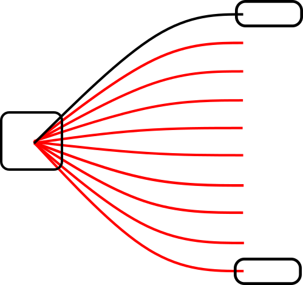
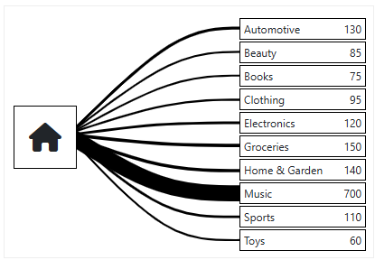

# Introduction 
This sample demonstrates how to convert an SVG image into a Blazor component, enabling dynamic data visualisation for up to ten categories.

A Visual Studio 2022 sample using a .NET 9 Blazor WebAssembly Standalone App.

# Creating SVG
The original **SVG image** was created in **Inkscape** using the **Pen Tool** to draw **Bezier curves**.
To remove **Inkscape** specific markup, the file was saved as a **Plain SVG**.



# Data
Using the following class to define the properties for each category. Data is loaded from some sample JSON files.

```
    public class DataFlowItem
    {
        // Index 1 to 10
        public required int Index { get; set; }
        public int StrokeWidth { get; set; } = 1;
        public string StrokeColor { get; set; } = "#000000";
        public string? Text { get; set; }
        public long? Total { get; set; }
        public int? ZIndex { get; set; }
    }
```

# Blazor Component
The Blazor **DataFlow** component consists of a **Chart** along with a **Box** and **Line** for each of the ten categories.

The SVG has been converted into the Line component.

```
<svg width="100%" height="100%" preserveAspectRatio="xMinYMin"
         viewBox="0 0 132.02708 124.08958"
        version="1.1"
        id="svg1"
        xmlns="http://www.w3.org/2000/svg"
        xmlns:svg="http://www.w3.org/2000/svg">            

        @if (Index == 1)
        {        
            <g>
                <path class="path" stroke-width="@StrokeWidth" stroke="@StrokeColor"
                      d="M 33.063706,100.52896 C 51.984557,82.181468 70.905406,63.833977 86.099533,54.660231 101.29366,45.486486 112.76062,45.486486 124.2278,45.486486"                      
                      transform="matrix(0.999935,0,0,1.0206023,0.00509974,-2.0759464)" />
            </g>        
        }
        else if (Index == 2)
        ...
    </svg>
```

In the **Line component**, the main SVG body has its **width** and **height** set to 100%, with **preserveAspectRatio** set to **xMinYMin** to maintain proper scaling.

The **Index** parameter determines which line is being drawn.

The **class path** is utilised for animation, while the **StrokeWidth** and **StrokeColor** parameters control the line's width and color.

# Sample Screenshot



# Live Demo

(https://witty-sand-010379403.6.azurestaticapps.net/)